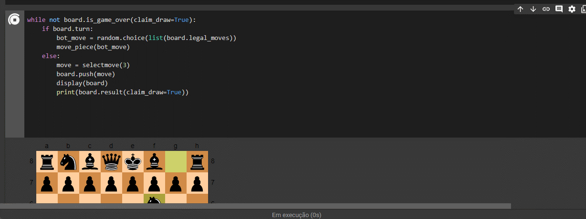

<h1 align="center"<strong> ♟ EP1 - Chess ♟ </strong></h1>

<h2 align="center"><strong>Descrição do projeto / Tecnologias Usadas</strong></h2>

<strong>Projeto criado para o curso de Ciência da Computação - IA </strong>

O objetivo deste EP foi desenvolvimento de uma engine que joga xadrez. Esta engine usa o algoritmo Minimax e Poda Alfabeta para o jogador que é o agente e joga contra um adversário humano ou um robô com escolhas de movimentos aleatórios. 
  
Usamos o Python como linguagem com o auxilio da lib "chess" https://python-chess.readthedocs.io/en/latest/

<h2 align="center"><strong>Feito por:</strong></h2>
  Daniel Bortoleti Melo, Stella Rufino, Mayara Rosa

<h2 align="center"><strong>Links :</strong></h2>

Teoria/Explicação 📝: https://www.canva.com/design/DAE6QvYEZq4/oFeBFzXmC4dAIbWlTwXRjQ/view?utm_content=DAE6QvYEZq4&utm_campaign=designshare&utm_medium=link&utm_source=publishsharelink

Vídeo/Execução 🎥: https://youtu.be/sTSvRrLYJLo

Rode o código sem precisar baixar em sua máquina 💻: https://colab.research.google.com/drive/1mZF6j1rnFb3JMaayzKSmOXEOm1GaMIx7?usp=sharing  

<h2 align="center"><strong>IA X Random</strong></h2>
Como podemos ver no gif abaixo a IA que são as peças pretas vence facilmente as brancas aleatórias com alguns movimentos. 

